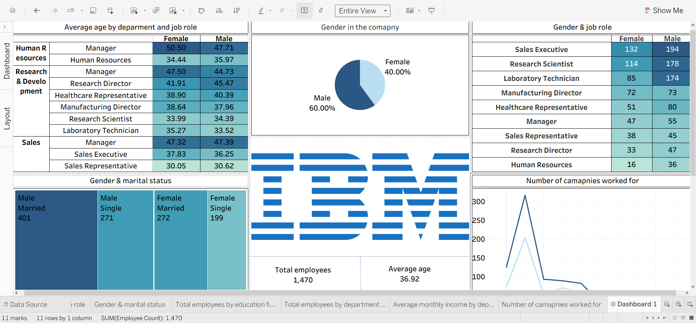

# 📊 Data Analysis Portfolio

Welcome to my data analysis portfolio! I'm Raymond, a data analyst with strong skills in data wrangling, statistical modeling, and data visualization. This portfolio showcases real-world projects that demonstrate my ability to extract insights from data and turn them into actionable outcomes using Python, R, Tableau, and SQL.

---

## Core Skills

- **Data Cleaning & Preprocessing**: Missing values, duplicates, outlier handling
- **Exploratory Data Analysis (EDA)**: Summary statistics, data profiling, visual analysis
- **Statistical Analysis**: Regression, hypothesis testing, time series, multivariate methods
- **Data Visualization**: Dashboards and visual stories using Tableau, Matplotlib, Seaborn, Plotly
- **Machine Learning**: Supervised and unsupervised learning, model evaluation (scikit-learn, caret)
- **SQL & Data Wrangling**: Data querying, joins, subqueries, aggregations
- **Tools & Tech**: Python, R, SQL, Tableau, Excel, Jupyter Notebooks, Git

---

## 📂 Featured Projects

### 1. 🚴 **Analysis of Bike Rides in Nairobi (2015–2016)**
**Tools**: Python, Tableau, matplotlib  
**Skills**: EDA, trend analysis, geospatial insights  
- Explored historical bike-sharing trends in Nairobi  
- Analyzed usage by time, season, and user type  
- Identified patterns in peak hours and urban mobility

 
[🔗 View Full Interactive Dashboard on Tableau Public](https://public.tableau.com/app/profile/ray.otieno/viz/NairobiBikeRidesProject/Dashboard1?publish=yes)

---

### 2. **Predictive Analysis of Netflix Shows by Country**
**Tools**: Python, scikit-learn, pandas, Tableau  
**Skills**: Predictive modeling, classification, data visualization  
- Predicted viewing trends of Netflix shows across different countries  
- Used classification models to identify preferences by region  
- Visualized global content distribution and genre trends

[🔗 View Full Interactive Dashboard on Tableau Public](https://public.tableau.com/app/profile/ray.otieno/viz/NetflixDashboard_17528676873730/Netflix?publish=yes)

---

### 3. **IBM Employee Salary Analysis**
**Tools**: R, ggplot2, dplyr, Tableau  
**Skills**: Descriptive stats, EDA, salary comparison  
- Analyzed internal salary data to assess pay disparities  
- Explored relationships between department, education, and compensation  
- Provided visual summaries for HR policy recommendations

[🔗 View Full Interactive Dashboard on Tableau Public](https://public.tableau.com/app/profile/ray.otieno/viz/IBMHRDashboard_17528679370860/Dashboard1?publish=yes)

---

### 4. 🌍 **IT Job Salaries by Country (Worldwide)**
**Tools**: Python, pandas, Tableau  
**Skills**: Data wrangling, geographic visualization, salary trends  
- Compared average salaries across countries in the tech industry  
- Mapped income by role and location using interactive plots  
- Provided insight into global tech compensation trends

[🔗 View Full Interactive Dashboard on Tableau Public](https://public.tableau.com/app/profile/ray.otieno/viz/JobSalariesDashboard_17528681625450/Dashboard1?publish=yes)

---

## 📬 Let's Connect

- 📧 Email: otienoraymond10@gmail.com  
- 💼 LinkedIn: (https://www.linkedin.com/in/raymond-otieno-88b41128a/)  
- 🌐 Portfolio Website: [Coming Soon]

---

> _“Without data, you're just another person with an opinion.”_ — W. Edwards Deming

Thanks for stopping by!
